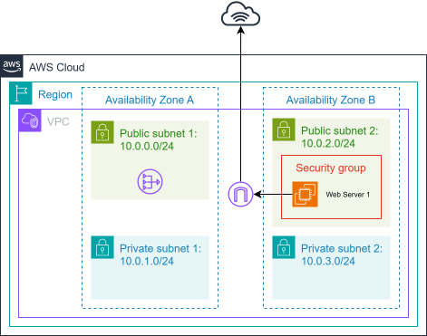

# Lab 267: Build Your VPC and Launch a Web Server

## Objective
The goal of this lab is to architect a custom network on AWS by creating a Virtual Private Cloud (VPC), configuring public and private subnets, setting up routing for internet access, and deploying a functional web server on an EC2 instance.

## Key Concepts
* **VPC (Virtual Private Cloud):** A logically isolated section of the AWS Cloud where you can launch AWS resources.
* **Subnets:** Segments of a VPC's IP address range. Public subnets have a direct route to an Internet Gateway, while private subnets do not.
* **Internet Gateway (IGW):** The "door" that allows communication between your VPC and the internet.
* **NAT Gateway:** Allows instances in a private subnet to connect to the internet (for updates, etc.) while preventing the internet from initiating a connection with them.
* **Security Groups:** Virtual firewalls that control inbound and outbound traffic at the instance level.

## Architecture Diagram
Below is the visual representation of the infrastructure built in this lab:



---

## Task 1 & 2: Creating the Network Infrastructure
In this phase, we build a VPC with a `/16` CIDR block and distribute subnets across different Availability Zones (AZs) to ensure high availability.

**Instructions:**
1. **Create VPC:** Use the "VPC and more" option in the AWS Console.
   * **Name Tag:** Lab VPC
   * **IPv4 CIDR:** `10.0.0.0/16`
   * **AZs:** 1 (initial setup)
   * **Public Subnet 1:** `10.0.0.0/24`
   * **Private Subnet 1:** `10.0.1.0/24`
2. **Add Additional Subnets:** Manually create two more subnets to expand the network to a second AZ:
   * **Public Subnet 2:** `10.0.2.0/24`
   * **Private Subnet 2:** `10.0.3.0/24`

> **📝 Technical Note: CIDR and AWS Reserved IPs**
> A `/24` subnet mask provides 256 IP addresses. However, AWS reserves **5 IP addresses** in each subnet:
> 1. `10.0.x.0`: Network address.
> 2. `10.0.x.1`: VPC router.
> 3. `10.0.x.2`: DNS mapping.
> 4. `10.0.x.3`: Future use.
> 5. `10.0.x.255`: Network broadcast (AWS does not support broadcast, but it's reserved).

---

## Task 3: Routing and Associations
Subnets are categorized as "Public" or "Private" based on their Route Table associations.

**Instructions:**
1. **Public Route Table:** Explicitly associate `Public Subnet 2`. This table includes a route to the Internet Gateway (`0.0.0.0/0 -> igw-xxxx`).
2. **Private Route Table:** Explicitly associate `Private Subnet 2`. This table uses a NAT Gateway for secure outbound internet access.

---

## Task 4 & 5: Security and Server Deployment
Deploying an EC2 instance into a public subnet to act as a web server accessible from the internet.

**Instructions:**
1. **Create Security Group:** Name it `Web Security Group`.
   * **Inbound Rule:** Add `HTTP` (Port 80) from `Anywhere IPv4`.
2. **Launch EC2 Instance:**
   * **Name:** `Web Server 1`
   * **Subnet:** Select `Public Subnet 2`.
   * **Auto-assign Public IP:** Enable.
   * **Security Group:** Select the `Web Security Group` created previously.
3. **Configure User Data:** Paste the automation script in the Advanced Details section.

### 📜 Automation Script (User Data)
```bash
#!/bin/bash
# Install Apache Web Server and PHP
yum install -y httpd mysql php
# Download Lab files
wget [https://aws-tc-largeobjects.s3.us-west-2.amazonaws.com/CUR-TF-100-RESTRT-1/267-lab-NF-build-vpc-web-server/s3/lab-app.zip](https://aws-tc-largeobjects.s3.us-west-2.amazonaws.com/CUR-TF-100-RESTRT-1/267-lab-NF-build-vpc-web-server/s3/lab-app.zip)
unzip lab-app.zip -d /var/www/html/
# Turn on web server
chkconfig httpd on
service httpd start
```
   > 💡**Pro-Tip**: When using User Data, remember that the script runs with root privileges only once during the first boot. If you make a mistake in the script, restarting the instance won't fix it; you usually need to recreate the instance or manually fix the configuration via SSH.

   > 💡**Pro-Tip**: Always verify your web server's status by using the Public IPv4 DNS in a browser once the instance shows `2/2 checks` passed

---

## Summary of Architecture Components

| Component | Description |
| :--- | :--- |
| **Lab VPC** | The main container with IP range `10.0.0.0/16`. |
| **Public Subnets** | Subnets with a route to the Internet Gateway (IGW). |
| **Private Subnets** | Subnets that use a NAT Gateway for outbound-only access. |
| **Web Security Group** | Firewall permitting port 80 (HTTP) traffic. |
| **Apache (httpd)** | The web server software installed via User Data. |

---

## Resource Cleanup
To avoid credit consumption in your Learner Lab:
1. Terminate the `Web Server 1` EC2 instance.
2. Delete the `Lab VPC` (Note: This will also delete the associated subnets, route tables, and Internet Gateway).
3. Confirm the **NAT Gateway** is also deleted.