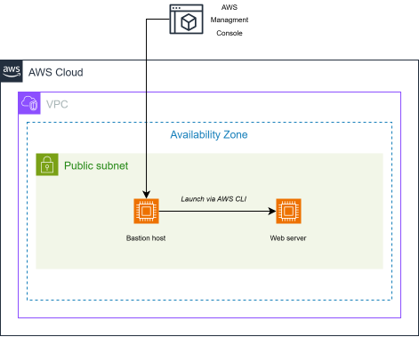

# Lab 171: Creating Amazon EC2 Instances (Console vs. CLI)

## Objective
This lab demonstrates two primary methods for provisioning compute resources: using the AWS Management Console for a manual setup and the AWS CLI for automated deployment. The final architecture consists of a Bastion Host used as a command center to launch a Web Server.

## Key Concepts
* **Bastion Host:** A server used to manage other instances in a network, providing a secure entry point.
* **EC2 Instance Connect:** A service that provides secure shell access to instances without needing a permanent SSH key or managing bastion keys.
* **Instance Metadata:** Data about your instance that you can use to configure or manage the running instance (e.g., `curl http://169.254.169.254/...`).
* **Systems Manager Parameter Store:** A centralized store to manage configuration data, such as retrieving the latest AMI ID automatically.

## Architecture Diagram



---

## Task 1: Launching via Management Console (Bastion Host)
Manual deployment is ideal for one-off instances or testing configurations.

**Key Configurations:**
- **AMI:** Amazon Linux 2.
- **Instance Type:** `t3.micro`.
- **Key Pair:** None (using EC2 Instance Connect).
- **Network:** Lab VPC / Public Subnet.
- **IAM Role:** `Bastion-Role` (Necessary to allow the CLI on the host to talk to AWS).

---

## Task 2 & 3: Launching via AWS CLI (Web Server)

Automation is achieved by retrieving environment variables and executing deployment commands from the Bastion Host.

### Step 1: Dynamic Data Retrieval

Instead of hardcoding IDs, we use CLI queries to find the right resources:

```bash
# Get Latest AMI
AMI=$(aws ssm get-parameters --names /aws/service/ami-amazon-linux-latest/amzn2-ami-hvm-x86_64-gp2 --query 'Parameters[0].[Value]' --output text)

# Get Subnet ID
SUBNET=$(aws ec2 describe-subnets --filters 'Name=tag:Name,Values=Public Subnet' --query Subnets[].SubnetId --output text)

# Get Security Group ID
SG=$(aws ec2 describe-security-groups --filters Name=group-name,Values=WebSecurityGroup --query SecurityGroups[].GroupId --output text)
```

### Step 2: The Launch Command

Using the variables retrieved, we launch the instance and inject User Data to install the web server:

```bash
aws ec2 run-instances \
--image-id $AMI \
--subnet-id $SUBNET \
--security-group-ids $SG \
--user-data file:///home/ec2-user/UserData.txt \
--instance-type t3.micro \
--tag-specifications 'ResourceType=instance,Tags=[{Key=Name,Value=Web Server}]'
```

> 📝 Technical Note: **User Data** - The `UserData.txt` script automates the installation of Apache and the deployment of the web application. This ensures that the server is ready to use immediately upon reaching the `running` state.

---

## Task 4: Verification

Testing the programmatic deployment:

1. Check State: `aws ec2 describe-instances --query 'Reservations[].Instances[].State.Name'`
2. Get URL: `aws ec2 describe-instances --query Reservations[].Instances[].PublicDnsName`

---

## 💡 Pro-Tips for Real-World Scenarios

1. **Choice of Tool**: 
    * Use the **Console** for quick, temporary testing.
    * Use **CLI/Scripts** for repeatable, reliable deployments.
    * Use **CloudFormation/Terraform (IaC)** for complex, related stacks of resources.

4. **Metadata Access**: Accessing `169.254.169.254` is a powerful way for scripts to "know where they are" (Region, AZ, Instance ID) without manual input.

5. **IAM Roles**: Always use IAM Instance Profiles instead of hardcoding Access Keys inside your EC2 instances for better security.

## Command Reference Summary

| **Component** | **Action** |
| :--- | :--- |
| `aws ssm get-parameters` | Set up security credentials and region. |
| `aws ec2 describe-subnets` | Create a new S3 bucket (Low-level API). |
| `aws ec2 run-instances` | Create a new identity in the account. |
| `aws ec2 describe-instances` | Copy a whole directory to S3. |

---
*Generated for the AWS re/Start Program*